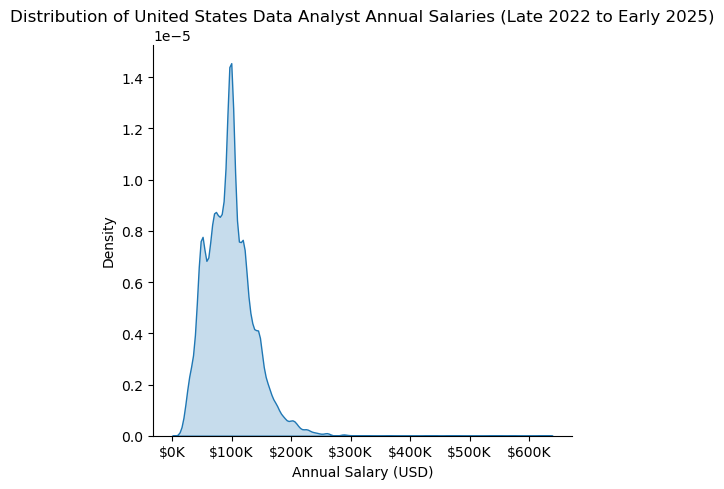
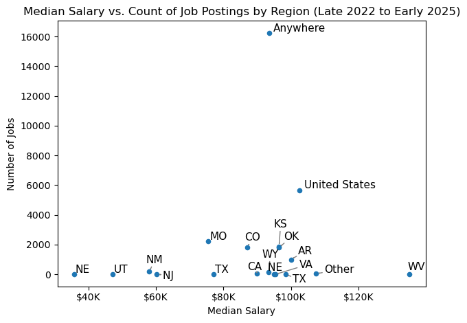
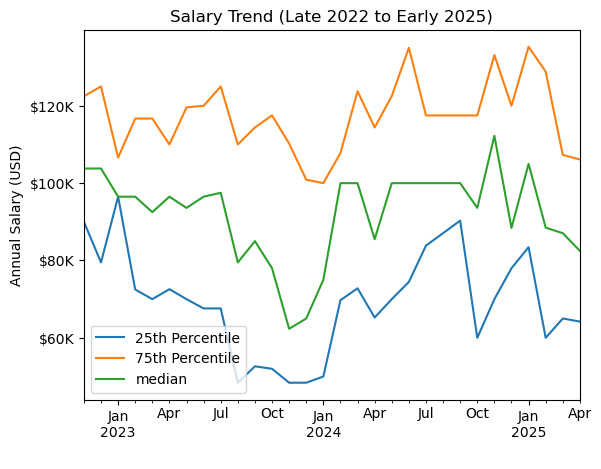
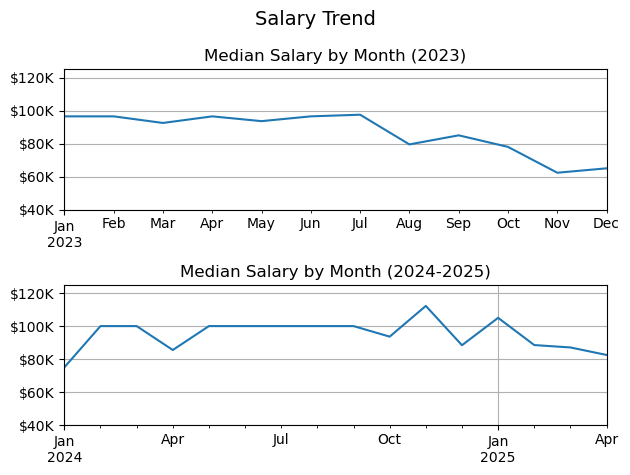
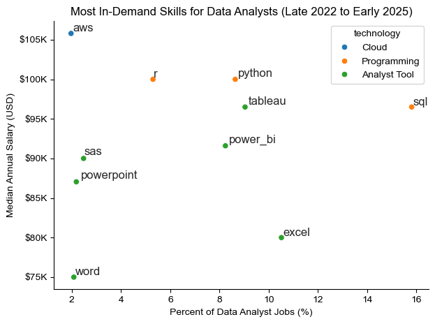
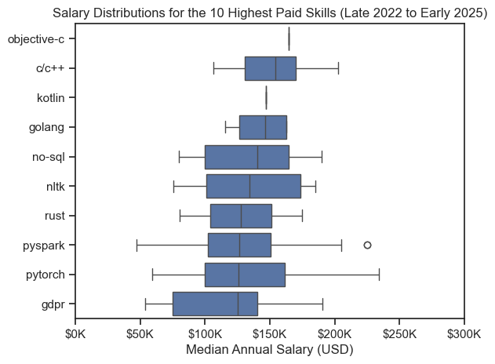
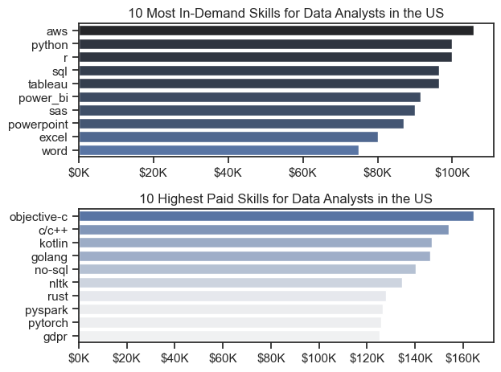

# Overview

## This project seeks to answer the following questions:

    A. What does the distribution of salary look like overall? 

    B. In what locations or regions are most companies hiring? 

    C. How are salaries trending? 

    D. What are the most optimal skills to learn for Data Analysts? (High-demand vs. high-paying) 

    E. For job seekers: How likely it is to get a job without a degree, and how reasonable it is to expect WFH & health benefits?

The data analyzed in this project was collected by Luke Barousse, a submariner-turned-data-analyst who has supported numerous individuals seeking to enter the data analytics field, including myself. The dataset provides comprehensive information on job titles, salaries, locations, essential skills, and other factors of interest to both job seekers and individuals exploring trends within the industry.

## Tools

1. Python: The foundation of this project. I also used the following libraries:
    - Pandas: for data analysis; 
    - Matplotlib & Seaborn: for data visualization; 

2. Jupyter Notebooks: I used this to run Python scripts; 

3. Visual Studio Code: for Python script execution; and

4. Git & GitHub: for version control and sharing.

## Data Cleaning and Preparation

### Step One - Importing libraries and loading data

```python
import ast
import numpy as np
import pandas as pd
from datasets import load_dataset
import matplotlib.pyplot as plt  
import seaborn as sns
from adjustText import adjust_text

# This is the "raw" dataset
df = pd.read_csv('/Users/andreawei/Documents/Learnings/Python Project/Datasets/gsearch_jobs.csv')
```
### Step Two - Preliminary Data Cleaning

Before diving into my analysis, I did the following to clean up or format the data:
1. Remove the rows where salary information wasn't available; 
2. Rename certain columns so the headings are more descriptive of the values; 
3. Reset index; 
4. Explode the 'job_skills' column (to pave the way for Objective E); and
5. Extract the "state" from the 'location' column (e.g., "California") and re-format the strings.

To find the details of these steps, please view my notebook: [Data_Cleaning_(Preliminary)](Data_Cleaning_(Preliminary).ipynb).

## In-Depth Analysis

The dataset covers positions posted between November 2022 and April 2025.

### Objective A - What does the distribution of salary look like overall? 

As shown in the histogram below (Plot 1), most data analyst jobs pay around $100,000 annually.

Plot 1


View Objective A notebook for details: [Objective_A_(Salary_Distribution)](Objective_A_(Salary_Distribution).ipynb).

### Objective B - In what locations or regions are most companies hiring? 

The majority of jobs are remote (indicated as "Anywhere" in Plot 2), which broadens opportunities beyond an individual's local region. For those living in states with fewer on-site positions or lower average salaries - such as Nebraska or Utah - remote work provides access to more competitive opportunities and potentially higher compensation.

Plot 2


View Objective B notebook for details: [Objective_B_(Job_Postings_by_Region)](Objective_B_(Job_Postings_by_Region).ipynb).

### Objective C - How are salaries trending? 

My initial goal was to determine whether there is an optimal time of year to find or switch jobs. However, as shown in Plot 3, no clear trend is evident. I attribute this to time-related data limitations. It is likely that a discernible trend could be identified with a dataset covering 5 to 10 years.

Plot 3 shows that while the salary at the 75th percentile has remained stable, the median and 25th percentile salaries have fluctuated drastically.

This suggests that if you are competitive job seeker (e.g., you have more expeirience or optimal skills (explored in Objective D)), you might not need to factor timing into your consideration.

Plot 3


The following visualization (Plot 4) indicates that the median salary dropped to around $60,000 in late 2023, potentially due to cyclical or market-driven influences, but recovered in early 2024.

Plot 4


View Objective C notebook for details: [Objective_C_(Salary_Trends)](Objective_C_(Salary_Trends).ipynb).

### Objective D - What are the most optimal skills to learn for Data Analysts? (High-demand vs. high-paying) 

As shown in Plot 5, SQL, Tableau, and Excel are the most in-demand skills; however, Plot 6 indicates they do not correspond to the highest-paying skills. This suggests that while these skills are important for entry into the field, advancing to higher salary levels typically requires ongoing skill development and specialization.

Plot 5


Plot 6


Plot 7 indicates that an entry-level data analyst is more likely to stand out if they are proficient in a programming language (e.g., Python) and a cloud platform (e.g., AWS).

Plot 7


View Objective D notebook for details: [Objective_D_(Skill_Salary_Analysis)](Objective_D_(Skill_Salary_Analysis).ipynb).


